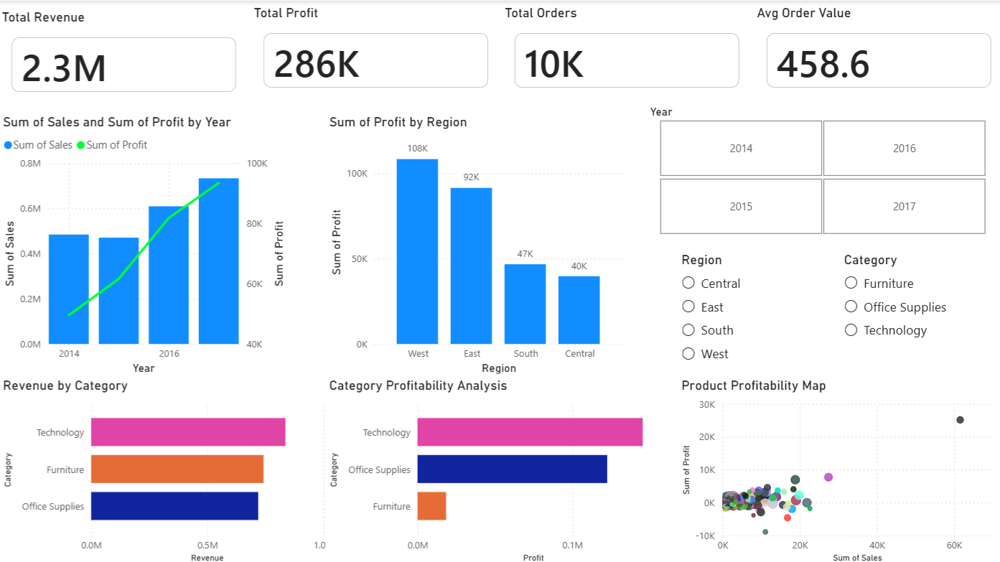

# FUTURE_DS_01

# Sales Analysis Dashboard (Power BI Project)

## Project Overview
This project analyzes sales data to identify key business insights such as revenue trends, top-performing categories, regional performance, and product profitability. The goal is to support data-driven business decisions.


## Objectives
- Analyze sales and profit trends over time  
- Identify top-performing products and categories  
- Evaluate regional performance  
- Understand business profitability  
- Provide actionable recommendations

## Dataset Used
- **Superstore Sales Dataset**  
- Source: Kaggle  
- Link: https://www.kaggle.com/datasets/vivek468/superstore-dataset-final
  

## Tools Used
- Power BI (Dashboard creation)  
- Excel / CSV (Data source)


##  Project Structure
```
sales-analysis-dashboard/
│
├── data/
├── dashboard/
├── screenshots/
├── analysis/
└── README.md
```
## Dashboard Features
- KPI Cards: Revenue, Profit, Orders, Avg Order Value  
- Sales & Profit Trend Analysis  
- Revenue by Category  
- Profit by Region  
- Product Profitability Scatter Plot  
- Interactive slicers (Year, Region, Category)  

## Key Insights
- Revenue and profit show steady growth over time  
- Regional performance is uneven  
- Some categories generate high revenue but lower profit margins  
- A small number of products contribute most of the revenue  

## Recommendations
- Focus on high-profit regions  
- Optimize pricing for low-margin products  
- Reduce focus on low-performing products  
- Improve average order value through bundling strategies  


## Dashboard Preview



